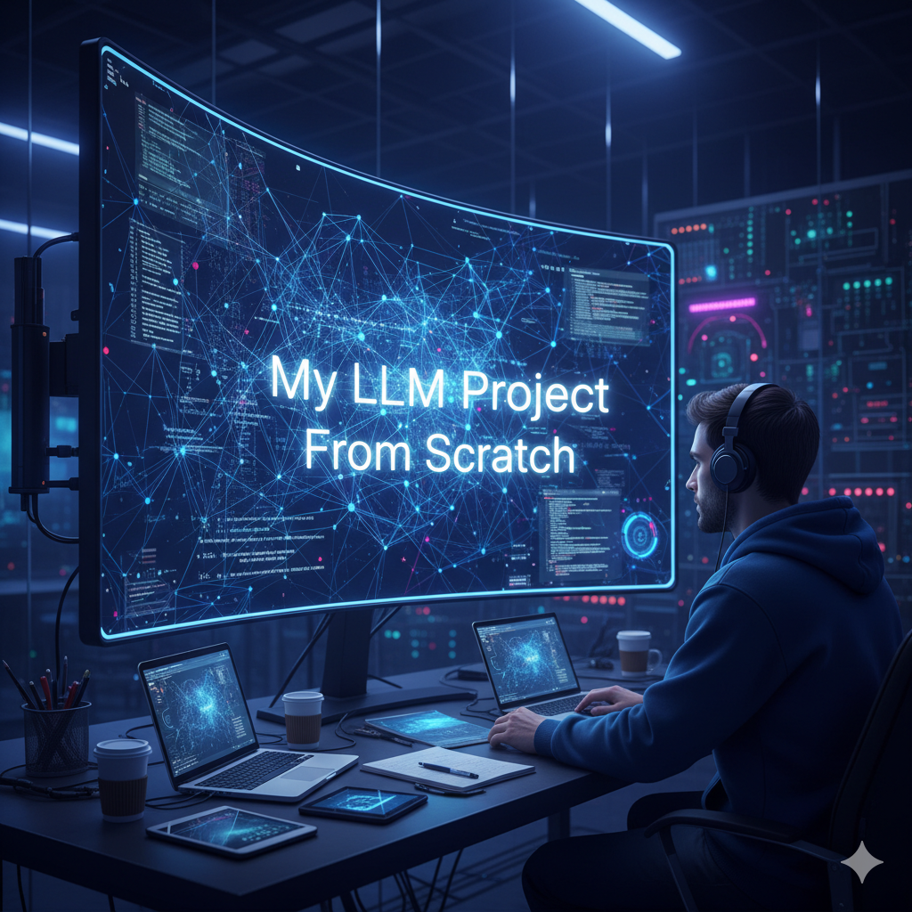
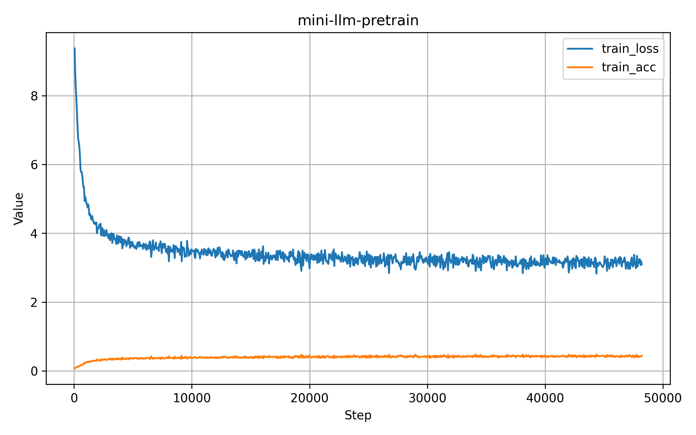
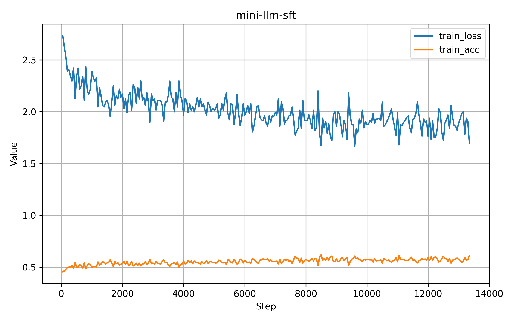
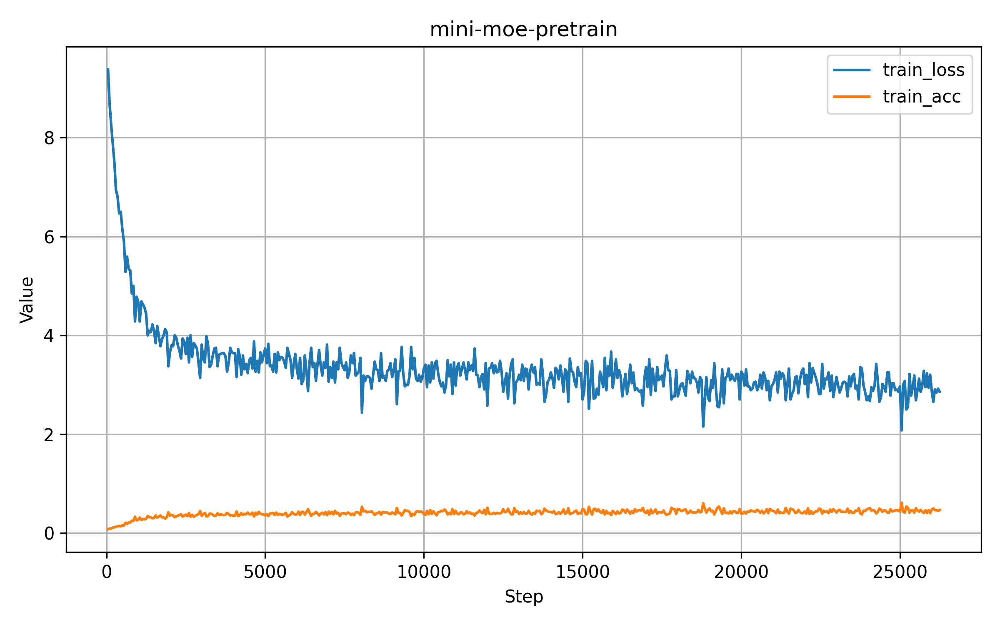
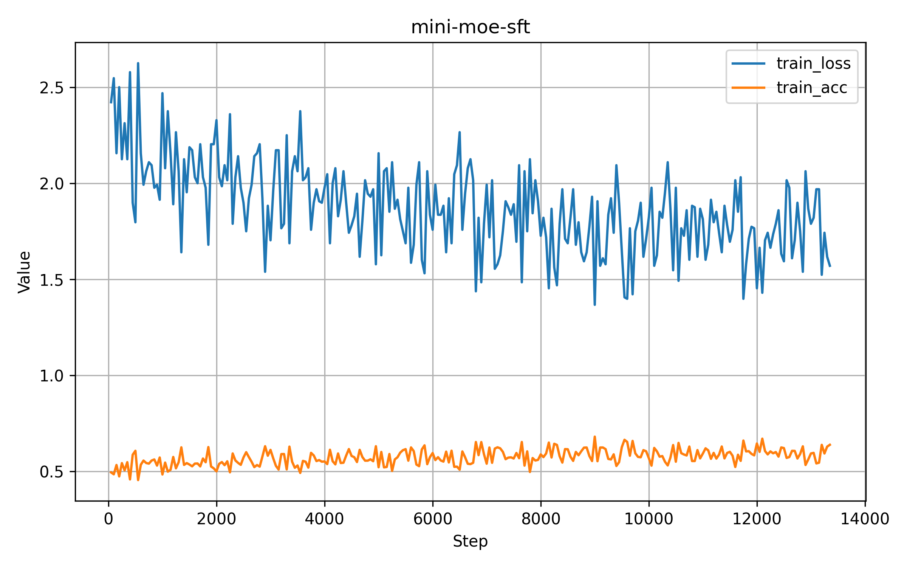
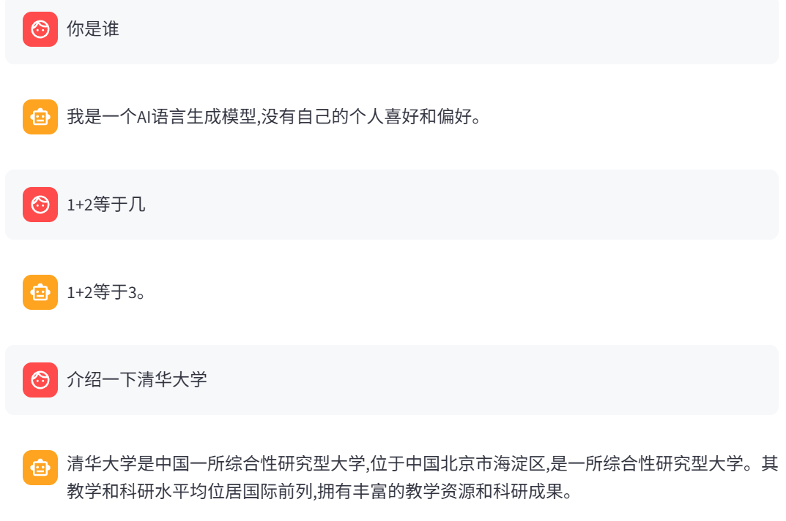

<div align="center">
<h1>🧠🔬 mini-llm — Build a Large Language Model from Scratch</h1>
</div>

<p align="center">
	<a href="README.md"></a>
	<a href="README_ZH.md"></a>
	<br/>
</p>

<p>
	<a href="https://www.python.org/"></a>
	<a href="https://pytorch.org/"></a>
	<a href="https://lightning.ai/"></a>
	<a href="https://github.com/huggingface/transformers"></a>
	<a href="https://hydra.cc/"></a>
	<a href="LICENSE"></a>
	<a href="https://github.com/caixiaoshun/mini-llm"></a>
	<a href="https://github.com/caixiaoshun/mini-llm"></a>
</p>

<p>
	<a href="https://colab.research.google.com/drive/1EwVictfkx6OUlu3yDuKfebvxeVUNEdbg?usp=sharing"></a>
	<a href="https://colab.research.google.com/drive/1hoLR-S-YeCS01CVh4x8qg25cpSmGVcxu?usp=sharing"></a>
	<a href="https://huggingface.co/spaces/caixiaoshun/mini-llm"></a>
	<a href="https://huggingface.co/caixiaoshun/mini-llm"></a>
</p>

<a href="https://huggingface.co/spaces/caixiaoshun/mini-llm">
	
</a>
<br/>

## 🆕 What's new

- 🧩 Mixture-of-Experts (MoE LLM): Sparse MoE feed-forward network, Noisy Top‑K router, and a balancing auxiliary loss (KL to uniform).
- 📚 Data pipeline: Unsupervised pretraining (next‑token prediction) and supervised fine-tuning (SFT, chat-template based).
- ⚡ Training stack: PyTorch + Lightning + Hydra for configuration, with TensorBoard visualization.
- 🚀 Inference & Demo: Minimal Python inference examples and Streamlit chat apps.
- 📦 Model sizes: mini-llm ≈ 171 MB, mini-moe ≈ 876 MB.


Great for learning the end-to-end LLM training loop: tokenizer/data → model → training → evaluation → inference/deployment.

## 📂 Project structure at a glance

```
configs/                 # Hydra configs (data, model, trainer, experiment bundles, etc.)
scripts/                 # Scripts for data download, tokenizer training, etc.
src/
  app/                   # Streamlit chat demos
  train.py               # Training entrypoint (Hydra)
  eval.py                # Evaluation entrypoint (Hydra)
tests/                   # Basic tests
requirements.txt         # Dependencies
```


## 🛠️ Environment setup and installation

Recommended: Python 3.11 and a suitable CUDA version (if training on GPU).

1) Create and activate a conda environment (Python 3.11, named mini-llm):

```bash
conda create -n mini-llm python=3.11 -y
conda activate mini-llm
```

2) Install dependencies:

```bash
pip install -r requirements.txt
```

3) Verify that PyTorch sees your GPU (optional):

```bash
python -c "import torch; print('cuda?', torch.cuda.is_available(), 'num', torch.cuda.device_count())"
```


## 📚🔤 Data and tokenizer

This project uses two types of datasets:

Datasets overview:

- ddzhu123/seq-monkey (general Chinese open corpus): multi-domain text (web pages, forums, encyclopedias, etc.), cleaned and deduplicated, suitable for autoregressive pretraining on next‑token prediction. The script extracts to `data/mobvoi_seq_monkey_general_open_corpus.jsonl`.
- BelleGroup/train_3.5M_CN (Chinese instruction-tuning corpus): ~3.5M dialogue pairs covering QA, writing, reasoning, coding, etc., suitable for SFT; in this repo we compute loss only on assistant spans. Please follow the dataset license and filter/clean as needed.

### ⚙️ One-click scripts (recommended on WSL/Git Bash)

See `scripts/download-data.sh` for automated data download steps.

### 🔤 Train the tokenizer (BPE + ByteLevel)

```bash
python scripts/train_tokenizer.py
```

The outputs are saved under `checkpoints/`. Training/inference loads the tokenizer from there.

### 📥 Download Pretrained Weights & Tokenizer

If you don't want to train from scratch, you can download the pretrained model weights and tokenizer directly from Hugging Face:

<a href="https://huggingface.co/caixiaoshun/mini-llm">
    
</a>

You can place the downloaded tokenizer files in the `checkpoints/` directory.


## 🧱🧩 Model architecture overview

### 🧱 Dense model (MiniLLM)

File: `src/models/components/mini_llm.py`

Design highlights:

- Decoder‑only architecture: pure autoregressive generation. We use a Pre‑Norm pattern (norm → sublayer → residual) for more stable training.
- Grouped Query Attention (GQA): serve more Q heads with fewer KV groups by repeating/sharing KV to reduce memory/compute while preserving capacity; uses native SDPA with strict causal masking.
- Rotary Position Embeddings (RoPE): inject relative position into Q/K to improve long-context generalization and some extrapolation ability.
- Feed-Forward Network (FFN): two-layer MLP with SiLU and dropout to provide nonlinearity and feature transformation.
- Weight tying: share output projection with token embeddings to reduce parameters and add mild regularization.

Training objective is next‑token prediction with cross-entropy loss; padding and non-supervised spans are masked out to avoid gradient pollution.

### 🧩 Mixture-of-Experts model (MiniMoE)

File: `src/models/components/mini_moe.py`

Design highlights (agnostic to specific hyperparameters):

- Sparse substitution: keep the dense model’s attention and normalization; replace each layer’s FFN with a sparse MoE FFN. Only tokens routed to an expert are processed, increasing capacity under fixed compute.
- Noisy Top‑K gating: the router scores token representations with noise injection to encourage exploration/diversity; selected experts are combined via gated weighted sum.
- Load balancing (aux loss): regularize routing distribution so experts receive comparable “importance/traffic,” preventing collapse; contributes to training loss, disabled during inference if desired.
- Preserve residual path: expert outputs merge back via residuals to stabilize gradients and information flow.

Lightning training module: `src/models/mini_llm_module.py`

- Wraps optimizer/scheduler, train/val/test loops, and metric logging in one place.
- Automatically handles “main loss + aux loss” composition for MoE and adapts to distributed/mixed‑precision training.


## 🏋️ Training

Run the following from the repo root. Lightning + Hydra will save logs to `logs/` by default.

Tip: For GPU training, try `configs/trainer/gpu.yaml` (bf16). You can also override `trainer.precision`, `trainer.devices`, `trainer.accumulate_grad_batches`, etc. via CLI.

### 🧾 Script shortcuts (scripts/)

`scripts/` provides 4 one‑click Bash scripts. Comments show equivalent Python commands for customization:

```bash
# Pretraining (Dense)
bash scripts/pretrain.sh
# Equivalent: python src/train.py experiment=pretrain logger=tensorboard

# SFT (Dense)
bash scripts/sft.sh
# Equivalent: python src/train.py experiment=sft model.net.pretrain_ckpt="<path-to-your-pretrain-ckpt>" logger=tensorboard

# Pretraining (MoE)
bash scripts/moe-pretrain.sh
# Equivalent: python src/train.py experiment=moe-pretrain logger=tensorboard

# SFT (MoE)
bash scripts/moe-sft.sh
# Equivalent: python src/train.py experiment=moe-sft model.net.pretrain_ckpt="<path-to-your-MoE-pretrain-ckpt>" logger=tensorboard
```

Note: To tweak batch size, precision, devices, etc., either edit the scripts or use the CLI to override as shown below.

### 📊 Reference Benchmarks

We provide reference training statistics based on our experiments.

- **Hardware**: 8× NVIDIA RTX 3090 (24GB VRAM)
- **Precision**: bf16-mixed (default in scripts)

| Model | Stage | Epochs | Duration |
| :--- | :--- | :--- | :--- |
| **mini-llm** | Pretrain | 2 | 13h 22m |
| **mini-llm** | SFT | 2 | 2h 56m |
| **mini-moe** | Pretrain | 1 | 22h 9m |
| **mini-moe** | SFT | 2 | 13h |

> **Note for smaller GPUs**: If you have less VRAM, try reducing `data.batch_size`, increasing `trainer.accumulate_grad_batches`, or using a smaller model config.

### 🥣 Training Recipe & Overrides

Minimal command:

```
python src/train.py experiment=pretrain logger=tensorboard
```

Common overrides (examples):

- Model size: `model.net.config.num_layers`, `model.net.config.dim`, `model.net.config.num_heads`, `model.net.config.num_kv_groups`
- Throughput: `data.batch_size`, `trainer.accumulate_grad_batches`, `trainer.devices`, `trainer.strategy`
- Precision/stability: `trainer.precision=bf16-true`, `trainer.grad_clip_val=1.0`

Example (small model + bf16):

```bash
	trainer.precision=bf16-true
```

SFT requires loading pretrained weights. Set `model.net.pretrain_ckpt` to your dense pretrain ckpt:

```bash
python src/train.py experiment=sft \
	model.net.pretrain_ckpt="logs/train/mini-llm/pretrain/<timestamp>/checkpoints/<best-or-last>.ckpt" \
	logger=tensorboard
```

Other useful overrides: `trainer.max_epochs`, `trainer.val_check_interval`, `data.max_seq_len`, `optim.lr`.

### 🔧 MoE training (pretraining → SFT)

Use `experiment=moe-pretrain` and `experiment=moe-sft` for the MoE runs:

# Pretraining (MoE) — typically smaller batch, larger accumulation
```bash
python src/train.py experiment=moe-pretrain logger=tensorboard
```

```bash
# More conservative memory settings
python src/train.py experiment=moe-pretrain \
	data.batch_size=4 trainer.accumulate_grad_batches=8 trainer.precision=bf16-true

# Quick debug
python src/train.py experiment=moe-pretrain trainer.max_epochs=1 trainer.limit_train_batches=0.1
```


## 📈 Training curves

Below are reference training curves for different stages:

<div align="center">
<table>
  <tr>
    <td align="center">
      
      <br/>mini-llm Pretrain
    </td>
    <td align="center">
      
      <br/>mini-llm SFT
    </td>
  </tr>
  <tr>
    <td align="center">
      
      <br/>mini-moe Pretrain
    </td>
    <td align="center">
      
      <br/>mini-moe SFT
    </td>
  </tr>
</table>
</div>


## 🚀 Inference and examples

<div align="center">

<p><em>mini-llm inference demo - showing chat interface and model responses</em></p>
</div>

Two options: use `chat()` from `MiniLLM`/`MiniMoE` directly, or run the Streamlit chat app.

### 🐍 Option A: Python script

```python
import torch
import hydra
from omegaconf import OmegaConf
from transformers import PreTrainedTokenizerFast

tokenizer = PreTrainedTokenizerFast.from_pretrained("checkpoints")

# Load dense LLM config and instantiate
cfg = OmegaConf.load("configs/model/mini-llm.yaml")["net"]
model = hydra.utils.instantiate(cfg)  # MiniLLM(config)
model.load_ckpt("logs/train/mini-llm/sft/<timestamp>/checkpoints/<best>.ckpt")
model.eval().to("cuda" if torch.cuda.is_available() else "cpu")

conversations = [
	{"role": "user", "content": "Introduce yourself in 2 sentences."}
]
print(model.chat(conversations, tokenizer, max_new_token=128, top_k=5))
```

MoE usage is identical (swap `mini-llm.yaml` for `mini-moe.yaml`). To disable the MoE auxiliary loss during inference, set `config.use_aux_loss=False` on load.

### 🗨️ Option B: Streamlit chat app (updated)

Two built-in UIs support multi-turn chat and streaming generation:

```bash
# 🤖 Dense UI (with hidden system prompt to strengthen "assistant persona")
streamlit run src/app/mini_llm_app.py

# 🤖 MoE UI (forces aux loss off during inference)
streamlit run src/app/mini_moe_app.py
```

Sidebar controls (both UIs):

- 🧮 Device (auto/cuda/cpu) and dtype (auto/float16/bfloat16/float32)
- 📝 Generation settings: max_new_tokens, Top‑K, temperature, seed
- ✂️ truncate_ctx to limit context length (avoid OOM)
- 🧹 Clear history

Differences:

- mini_llm_app:
	- Injects a system persona via `SYSTEM_PROMOT` (hidden in the first round, used for inference but not rendered).
	- Defaults: `TOKENIZER_PATH = "checkpoints"`, `CONFIG_PATH = "configs/model/mini-llm.yaml"`.
- mini_moe_app:
	- Sets `model_cfg["config"]["use_aux_loss"] = False` after loading to ensure no aux loss during inference.
	- Defaults: `truncate_ctx = 512` for more conservative memory usage.

Both apps use `top_k_sample` and render incrementally. To swap model weights/tokenizer, edit the constants at the top: `CONFIG_PATH`, `CKPT_PATH`, `TOKENIZER_PATH`.

## ☁️ One-click try on Google Colab

Open the demo notebooks in Colab:

- mini-llm (Dense): [](https://colab.research.google.com/drive/1EwVictfkx6OUlu3yDuKfebvxeVUNEdbg?usp=sharing)
- mini-moe (MoE): [](https://colab.research.google.com/drive/1hoLR-S-YeCS01CVh4x8qg25cpSmGVcxu?usp=sharing)

Tips for Colab:

- Enable GPU (Runtime → Change runtime type → select T4/L4/A100, etc.).
- If dependencies aren’t auto‑installed, run the following cell (optional):

```python
# Optional: clone repo and install deps
!git clone https://github.com/caixiaoshun/mini-llm.git
%cd mini-llm
!pip -q install -r requirements.txt
```

For networks with limited access, consider mirror sources or place data under /content and update config paths accordingly.


## 🌐 Online demo (Hugging Face Spaces)

<a href="https://huggingface.co/spaces/caixiaoshun/mini-llm">
		
</a>

Notes:

- The Space provides a web chat interface for quick trials and demos.
- Due to resource quotas, cold start may take time; idle sessions may sleep.
- If memory is limited, reduce context length or `max_new_tokens`, or choose CPU/low-precision.

## 📊 Logging and visualization

- Training logs and checkpoints: written to `logs/` by default.
- TensorBoard: after enabling `logger=tensorboard` in the experiment yaml, start it with:

```bash
tensorboard --logdir logs
```


## 📄 Data/format notes and alignment

- Pretraining data: `data/mobvoi_seq_monkey_general_open_corpus.jsonl`, one JSON per line with key `text`.
	- Dataset: `src/data/components/pretrain_dataset.py` prepends BOS, left-shifts labels, and masks with `-100`.
- SFT data: `data/train_3.5M_CN.json`, one JSON per line with key `conversations` (Belle/ShareGPT style).
	- Dataset: `src/data/components/sft_dataset.py` normalizes `{"from":"human"}` to `{"role":"user"}`,
		uses tokenizer `chat_template`, and computes loss only on assistant tokens (others set to `-100`).


## 📜 License

This project is released under the Apache-2.0 license (see `LICENSE`).

## 🙏 Acknowledgements

<table>
<tr>
<td>
<h3>📚 Datasets</h3>
<p>
<a href="https://www.modelscope.cn/datasets/ddzhu123/seq-monkey"></a>
<a href="https://huggingface.co/datasets/BelleGroup/train_3.5M_CN"></a>
<br/>
<sub>Thanks to the data community for high-quality open corpora</sub>
<p>
</td>
<td>
<h3>🧰 Frameworks & libraries</h3>
<p>
<a href="https://pytorch.org/"></a>
<a href="https://lightning.ai/"></a>
<a href="https://github.com/huggingface/transformers"></a>
<a href="https://github.com/huggingface/datasets"></a>
<a href="https://hydra.cc/"></a>
<br/>
<sub>Thanks to these excellent open-source foundations</sub>
<p>
</td>
<td>
<h3>🧪 Project template</h3>
<p>
<a href="https://github.com/ashleve/lightning-hydra-template">
	
</a>
<br/>
<sub>This project customizes and extends that template</sub>
<p>
</td>
</tr>
</table>


