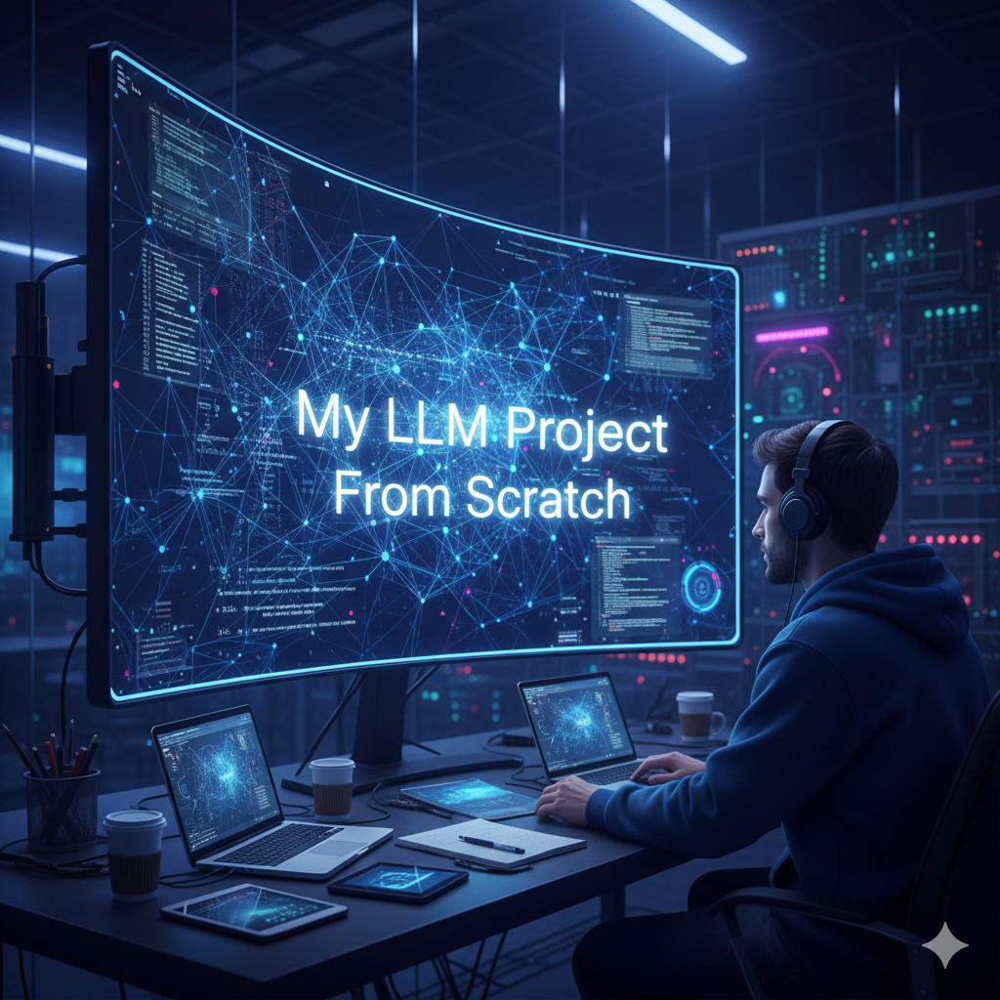
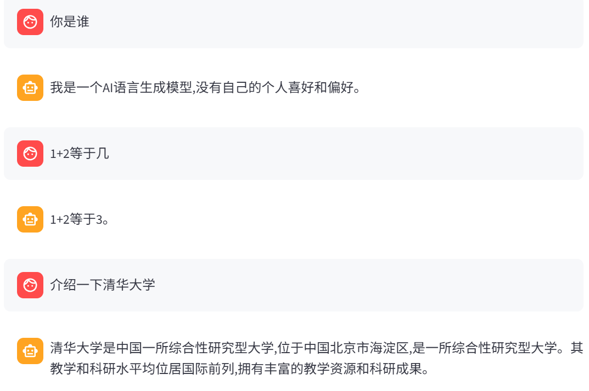

<div align="center">
<h1>🧠🔬 mini-llm — 从零构建大语言模型</h1>
</div>

<p align="center">
	<a href="README.md"></a>
	<a href="README_ZH.md"></a>
	<br/>
</p>

<p>
	<a href="https://www.python.org/"></a>
	<a href="https://pytorch.org/"></a>
	<a href="https://lightning.ai/"></a>
	<a href="https://github.com/huggingface/transformers"></a>
	<a href="https://hydra.cc/"></a>
	<a href="LICENSE"></a>
	<a href="https://github.com/caixiaoshun/mini-llm"></a>
	<a href="https://github.com/caixiaoshun/mini-llm"></a>
</p>

<p>
	<a href="https://colab.research.google.com/drive/1EwVictfkx6OUlu3yDuKfebvxeVUNEdbg?usp=sharing"></a>
	<a href="https://colab.research.google.com/drive/1hoLR-S-YeCS01CVh4x8qg25cpSmGVcxu?usp=sharing"></a>
	<a href="https://huggingface.co/spaces/caixiaoshun/mini-llm"></a>
	<a href="https://huggingface.co/caixiaoshun/mini-llm"></a>
</p>

<a href="https://huggingface.co/spaces/caixiaoshun/mini-llm">
	
</a>
<br/>

## 🆕 有什么新特性

- 🧩 稀疏专家 MoE：稀疏 MoE 前馈网络、带噪 Top‑K 路由、均衡辅助损失（相对均匀的 KL）。
- 📚 数据流水线：无监督预训练（下一个 token 预测）与有监督指令微调（SFT，基于 chat-template）。
- ⚡ 训练技术栈：PyTorch + Lightning + Hydra 配置管理，支持 TensorBoard 可视化。
- 🚀 推理与演示：最小可用的 Python 推理示例 + Streamlit 聊天应用。
- 📦 模型大小：mini-llm ≈ 171 MB，mini-moe ≈ 876 MB。


非常适合学习端到端的 LLM 训练闭环：分词/数据 → 模型 → 训练 → 评估 → 推理/部署。

## 📂 项目结构速览

```
configs/                 # Hydra 配置（数据、模型、训练器、实验组合等）
scripts/                 # 数据下载、分词器训练等脚本
src/
  app/                   # Streamlit 聊天演示
  train.py               # 训练入口（Hydra）
  eval.py                # 评估入口（Hydra）
tests/                   # 基础测试
requirements.txt         # 依赖
```

## 🛠️ 环境与安装

推荐：Python 3.11；若用 GPU 训练，安装匹配的 CUDA 版本。

1) 创建并激活 conda 环境（Python 3.11，环境名 mini-llm）：

```bash
conda create -n mini-llm python=3.11 -y
conda activate mini-llm
```

2) 安装依赖：

```bash
pip install -r requirements.txt
```

3) 验证 PyTorch 是否能检测到 GPU（可选）：

```bash
python -c "import torch; print('cuda?', torch.cuda.is_available(), 'num', torch.cuda.device_count())"
```

## 📚🔤 数据与分词器

本项目包含两类数据集：

数据集说明：

- ddzhu123/seq-monkey（中文通用开放语料）：多领域文本（网页、论坛、百科等），已清洗去重，适合自回归预训练；脚本导出为 `data/mobvoi_seq_monkey_general_open_corpus.jsonl`。
- BelleGroup/train_3.5M_CN（中文指令微调语料）：约 350 万条多轮对话，覆盖 QA、写作、推理、编程等；适合 SFT；本仓仅对 assistant 片段计算损失。请遵循数据集许可并按需过滤清洗。

### ⚙️ 一键脚本（推荐在 WSL/Git Bash）

参见 `scripts/download-data.sh` 获取自动化下载步骤。

### 🔤 训练分词器（BPE + ByteLevel）

```bash
python scripts/train_tokenizer.py
```

输出保存在 `checkpoints/` 下；训练/推理均从该目录加载分词器。

### 📥 下载预训练权重与分词器

如果你不想从头训练，可以直接从 Hugging Face 下载预训练好的模型权重和分词器：

<a href="https://huggingface.co/caixiaoshun/mini-llm">
    
</a>

你可以将下载的分词器文件放置在 `checkpoints/` 目录下。

## 🧱🧩 模型结构概览

### 🧱 MiniLLM

文件：`src/models/components/mini_llm.py`

设计要点：

- 纯解码自回归架构，采用 Pre‑Norm（Norm → 子层 → 残差）以提升稳定性。
- 组查询注意力 GQA：通过共享/复用 KV，以更少的 KV 组服务更多 Q 头，降低显存与计算；基于原生 SDPA 与严格因果掩码。
- 旋转位置编码 RoPE：为 Q/K 注入相对位置信息，增强长上下文泛化与一定外推能力。
- 前馈网络 FFN：两层 MLP + SiLU + Dropout，提供非线性与特征变换。
- 权重共享：输出投影与词嵌入共享，降低参数量并带来轻微正则化。

训练目标为下一个 token 的交叉熵；对 padding 及非监督片段做 `-100` 掩码，避免梯度污染。

### 🧩 专家混合模型（MiniMoE）

文件：`src/models/components/mini_moe.py`

设计要点（与具体超参无关）：

- 稀疏替换：保留Dense模型中的注意力与归一化，将每层 FFN 替换为稀疏 MoE FFN；仅被路由选中的 token 会被专家处理，在相同计算预算下提升容量。
- 带噪 Top‑K 路由：路由器给 token 表示打分并注入噪声，鼓励探索与多样性；选中的专家输出按门控权重加权求和。
- 负载均衡（辅助损失）：正则化路由分布，使专家获得相近的“重要性/流量”，防止坍塌；贡献到训练损失，推理时可关闭。
- 保留残差路径：专家输出通过残差回并，稳定梯度与信息流。

Lightning 训练模块：`src/models/mini_llm_module.py`

- 统一封装优化器/调度器、训练/验证/测试循环与指标记录。
- 自动处理 MoE 的“主损失 + 辅助损失”组合，并适配分布式/混精训练。

## 🏋️ 训练

从仓库根目录运行。Lightning + Hydra 默认将日志写入 `logs/`。

提示：若用 GPU，建议试试 `configs/trainer/gpu.yaml`（bf16）。也可用 CLI 覆盖 `trainer.precision`、`trainer.devices`、`trainer.accumulate_grad_batches` 等。

### 🧾 脚本快捷方式（scripts/）

`scripts/` 下提供 4 个一键 Bash 脚本，注释中给出了等价的 Python 命令，便于自定义：

```bash
# 预训练（Dense）
bash scripts/pretrain.sh
# 等价：python src/train.py experiment=pretrain logger=tensorboard

# SFT（Dense）
bash scripts/sft.sh
# 等价：python src/train.py experiment=sft model.net.pretrain_ckpt="<path-to-your-pretrain-ckpt>" logger=tensorboard

# 预训练（MoE）
bash scripts/moe-pretrain.sh
# 等价：python src/train.py experiment=moe-pretrain logger=tensorboard

# SFT（MoE）
bash scripts/moe-sft.sh
# 等价：python src/train.py experiment=moe-sft model.net.pretrain_ckpt="<path-to-your-MoE-pretrain-ckpt>" logger=tensorboard
```

说明：如需调整 batch、精度、设备等，可直接编辑脚本或使用 CLI 覆盖。

### 📊 参考基准

以下是我们实验的参考统计数据。

- **硬件**: 8× NVIDIA RTX 3090 (24GB 显存)
- **精度**: bf16-mixed (脚本默认)

| 模型 | 阶段 | 轮数 (Epochs) | 时长 |
| :--- | :--- | :--- | :--- |
| **mini-llm** | 预训练 | 2 | 13小时22分钟 |
| **mini-llm** | SFT | 2 | 2小时56分 |
| **mini-moe** | 预训练 | 1 | 22小时9分钟 |
| **mini-moe** | SFT | 2 | 13小时 |

> **显存不足？**：建议降低 `data.batch_size` 并增加 `trainer.accumulate_grad_batches`，或使用更小的模型配置。

### 🥣 训练配方与参数覆盖

启动训练的最小命令：

```
python src/train.py experiment=pretrain logger=tensorboard
```

常用覆盖示例：

- 模型大小：`model.net.config.num_layers`、`model.net.config.dim`、`model.net.config.num_heads`、`model.net.config.num_kv_groups`
- 吞吐相关：`data.batch_size`、`trainer.accumulate_grad_batches`、`trainer.devices`、`trainer.strategy`
- 精度/稳定性：`trainer.precision=bf16-true`、`trainer.grad_clip_val=1.0`

示例（小模型 + bf16）：

```bash
	trainer.precision=bf16-true
```

SFT 需要加载预训练权重。将 `model.net.pretrain_ckpt` 设为你的Dense预训练权重：

```bash
python src/train.py experiment=sft \
	model.net.pretrain_ckpt="logs/train/mini-llm/pretrain/<timestamp>/checkpoints/<best-or-last>.ckpt" \
	logger=tensorboard
```

其他常用覆盖：`trainer.max_epochs`、`trainer.val_check_interval`、`data.max_seq_len`、`optim.lr`。

### 🔧 MoE 训练（预训练 → SFT）

MoE 训练请使用 `experiment=moe-pretrain` 与 `experiment=moe-sft`：

# 预训练（MoE）——通常较小 batch、较大的累积步
```bash
python src/train.py experiment=moe-pretrain logger=tensorboard
```

```bash
# 更保守的显存设置
python src/train.py experiment=moe-pretrain \
	data.batch_size=4 trainer.accumulate_grad_batches=8 trainer.precision=bf16-true

# 快速调试
python src/train.py experiment=moe-pretrain trainer.max_epochs=1 trainer.limit_train_batches=0.1
```

## 📈 训练曲线

下图展示了不同阶段的参考训练曲线：

<div align="center">
<table>
  <tr>
    <td align="center">
      
      <br/>mini-llm 预训练
    </td>
    <td align="center">
      
      <br/>mini-llm SFT
    </td>
  </tr>
  <tr>
    <td align="center">
      
      <br/>mini-moe 预训练
    </td>
    <td align="center">
      
      <br/>mini-moe SFT
    </td>
  </tr>
</table>
</div>

## 🚀 推理与示例

<div align="center">

<p><em>mini-llm 推理演示 —— 展示聊天界面与模型回复</em></p>
</div>

两种方式：直接调用 `MiniLLM`/`MiniMoE` 的 `chat()`，或运行 Streamlit 聊天应用。

### 🐍 方式 A：Python 脚本

```python
import torch
import hydra
from omegaconf import OmegaConf
from transformers import PreTrainedTokenizerFast

tokenizer = PreTrainedTokenizerFast.from_pretrained("checkpoints")

# 加载Dense LLM 配置并实例化
cfg = OmegaConf.load("configs/model/mini-llm.yaml")["net"]
model = hydra.utils.instantiate(cfg)  # MiniLLM(config)
model.load_ckpt("logs/train/mini-llm/sft/<timestamp>/checkpoints/<best>.ckpt")
model.eval().to("cuda" if torch.cuda.is_available() else "cpu")

conversations = [
	{"role": "user", "content": "请用两句话介绍你自己。"}
]
print(model.chat(conversations, tokenizer, max_new_token=128, top_k=5))
```

MoE 用法一致（将 `mini-llm.yaml` 替换为 `mini-moe.yaml`）。若推理时需关闭 MoE 辅助损失，请在加载后设置 `config.use_aux_loss = False`。

### 🗨️ 方式 B：Streamlit 聊天应用（已更新）

内置两个 UI，支持多轮对话与流式生成：

```bash
# 🤖 Dense模型 UI（隐藏 system prompt，强化助手人设）
streamlit run src/app/mini_llm_app.py

# 🤖 MoE 模型 UI（强制关闭推理时辅助损失）
streamlit run src/app/mini_moe_app.py
```

侧边栏功能（两者共有）：

- 🧮 设备（auto/cuda/cpu）与精度（auto/float16/bfloat16/float32）
- 📝 生成参数：max_new_tokens、Top‑K、temperature、seed
- ✂️ truncate_ctx 控制上下文长度（避免 OOM）
- 🧹 清空历史

差异：

- mini_llm_app：
	- 通过 `SYSTEM_PROMOT` 注入系统人设（首轮隐藏，用于推理不渲染）。
	- 默认：`TOKENIZER_PATH = "checkpoints"`，`CONFIG_PATH = "configs/model/mini-llm.yaml"`。
- mini_moe_app：
	- 在加载后设置 `model_cfg["config"]["use_aux_loss"] = False`，确保推理不计算辅助损失。
	- 默认：`truncate_ctx = 512`，更保守的显存使用。

两者均使用 `top_k_sample`，并支持增量渲染。若需更换权重/分词器，请修改顶部常量：`CONFIG_PATH`、`CKPT_PATH`、`TOKENIZER_PATH`。

## ☁️ 一键体验（Google Colab）

在 Colab 打开演示 Notebook：

- mini-llm（Dense）：[](https://colab.research.google.com/drive/1EwVictfkx6OUlu3yDuKfebvxeVUNEdbg?usp=sharing)
- mini-moe（MoE）：[](https://colab.research.google.com/drive/1hoLR-S-YeCS01CVh4x8qg25cpSmGVcxu?usp=sharing)

小提示：

- 记得启用 GPU（Runtime → Change runtime type → 选择 T4/L4/A100 等）。
- 若依赖未自动安装，可执行下列单元（可选）：

```python
# Optional: clone repo and install deps
!git clone https://github.com/caixiaoshun/mini-llm.git
%cd mini-llm
!pip -q install -r requirements.txt
```

若网络受限，可考虑镜像源或将数据放置在 /content，并在配置中相应修改路径。

## 🌐 在线演示（Hugging Face Spaces）


<a href="https://huggingface.co/spaces/caixiaoshun/mini-llm">
		
</a>

说明：

- 提供简洁的网页聊天界面以快速体验。
- 由于资源配额，冷启动可能较慢；空闲会进入休眠。
- 若显存有限，请减少上下文长度或 `max_new_tokens`，或选择 CPU/低精度。

## 📊 训练日志与可视化

- 训练日志与检查点默认写入 `logs/`。
- TensorBoard：在实验 yaml 中启用 `logger=tensorboard` 后，运行：

```bash
tensorboard --logdir logs
```

## 📄 数据格式与对齐说明

- 预训练数据：`data/mobvoi_seq_monkey_general_open_corpus.jsonl`，每行一个 JSON，键为 `text`。
	- 数据集处理：`src/data/components/pretrain_dataset.py` 预置 BOS、左移标签，并用 `-100` 做掩码。
- SFT 数据：`data/train_3.5M_CN.json`，每行一个 JSON，键为 `conversations`（Belle/ShareGPT 风格）。
	- 数据集处理：`src/data/components/sft_dataset.py` 规范化 `{"from":"human"}` 为 `{"role":"user"}`，
		使用分词器 `chat_template`，仅对 assistant token 计算损失（其余置为 `-100`）。

## 📜 许可证

本项目以 Apache-2.0 许可证发布（见 `LICENSE`）。

## 🙏 致谢

<table>
<tr>
<td>
<h3>📚 数据集</h3>
<p>
<a href="https://www.modelscope.cn/datasets/ddzhu123/seq-monkey"></a>
<a href="https://huggingface.co/datasets/BelleGroup/train_3.5M_CN"></a>
<br/>
<sub>感谢数据社区提供高质量开放语料</sub>
<p>
</td>
<td>
<h3>🧰 框架与库</h3>
<p>
<a href="https://pytorch.org/"></a>
<a href="https://lightning.ai/"></a>
<a href="https://github.com/huggingface/transformers"></a>
<a href="https://github.com/huggingface/datasets"></a>
<a href="https://hydra.cc/"></a>
<br/>
<sub>感谢这些优秀的开源基石</sub>
<p>
</td>
<td>
<h3>🧪 项目模板</h3>
<p>
	<a href="https://github.com/ashleve/lightning-hydra-template">
		
	</a>
	<br/>
	<sub>本项目在其模板基础上定制与扩展</sub>
<p>
</td>
</tr>
</table>